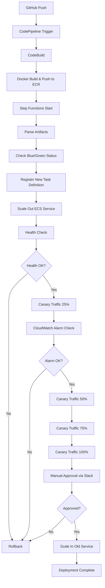

# 📚 Restaurant Management System - Complete Documentation

## 📋 Mục lục

1. [Tổng quan hệ thống](#tổng-quan-hệ-thống)
2. [Kiến trúc và công nghệ](#kiến-trúc-và-công-nghệ)
3. [Tính năng chính](#tính-năng-chính)
4. [CI/CD Pipeline](#cicd-pipeline)
5. [Cấu trúc dự án](#cấu-trúc-dự-án)
6. [Hướng dẫn triển khai](#hướng-dẫn-triển-khai)
7. [Monitoring và Logging](#monitoring-và-logging)
8. [Troubleshooting](#troubleshooting)

---

## 🏗️ Tổng quan hệ thống

### Mô tả dự án
Hệ thống quản lý nhà hàng trực tuyến hỗ trợ đặt bàn và đặt đồ ăn với khả năng xử lý 80-150 người dùng đồng thời trong giờ cao điểm. Hệ thống được thiết kế với kiến trúc Blue/Green Deployment để đảm bảo high availability và minimal downtime.

### Mục tiêu chính
- **High Availability**: Đảm bảo hệ thống luôn sẵn sàng phục vụ
- **Minimal Downtime**: Giảm thiểu gián đoạn khi deploy
- **Operational Safety**: Hạn chế rủi ro khi phát hành phiên bản mới
- **Cost Optimization**: Tối ưu chi phí vận hành trên AWS
- **Automation**: Tự động hóa quy trình CI/CD

---

## 🏛️ Kiến trúc và công nghệ

### Frontend Architecture
```
┌─────────────────┐    ┌──────────────────┐    ┌─────────────────┐
│   User Browser  │───▶│  Application     │───▶│   Backend API   │
│                 │    │  Load Balancer   │    │   (Monolith)│
└─────────────────┘    └──────────────────┘    └─────────────────┘
                              │
                              ▼
                    ┌──────────────────┐
                    │  ECS Fargate     │
                    │  (Blue/Green)    │
                    └──────────────────┘
```

### Technology Stack

#### Frontend
- **Framework**: ASP.NET Core 8.0 MVC
- **UI**: Razor Pages, Bootstrap, jQuery
- **Payment**: VNPay Integration
- **Session**: In-Memory Session Store
- **Container**: Docker (Multi-stage build)

#### Backend Infrastructure
- **Container Orchestration**: Amazon ECS Fargate
- **Load Balancer**: Application Load Balancer (ALB)
- **Container Registry**: Amazon ECR
- **Database**: Amazon RDS (SQL Server)
- **API Gateway**: AWS API Gateway
- **Networking**: Amazon VPC

#### CI/CD & DevOps
- **Source Control**: GitHub
- **CI/CD**: AWS CodePipeline + CodeBuild
- **Orchestration**: AWS Step Functions
- **Serverless**: AWS Lambda
- **Monitoring**: Amazon CloudWatch
- **Notifications**: Amazon SNS + Slack Integration
- **Secrets**: AWS Secrets Manager
- **Storage**: Amazon S3

---

## 🎯 Tính năng chính

### 1. Quản lý người dùng
- **Đăng ký/Đăng nhập**: Authentication với session management
- **Profile Management**: Cập nhật thông tin cá nhân
- **Password Management**: Đổi mật khẩu an toàn

### 2. Quản lý Menu
- **Hiển thị Menu**: Danh sách món ăn theo category và region
- **Tìm kiếm**: Tìm kiếm món ăn theo tên
- **Lọc**: Lọc theo danh mục và vùng miền
- **API Integration**: Kết nối với backend microservice

### 3. Đặt bàn (Table Booking)
- **Đặt bàn trực tuyến**: Chọn thời gian và số lượng khách
- **Quản lý đơn đặt**: Xem lịch sử đặt bàn
- **Thanh toán cọc**: Tích hợp VNPay

### 4. Đặt đồ ăn (Food Ordering)
- **Giỏ hàng**: Thêm/xóa món ăn
- **Đặt hàng**: Tạo đơn hàng từ giỏ hàng
- **Thanh toán**: VNPay payment gateway

### 5. Thanh toán VNPay
- **Payment Processing**: Xử lý thanh toán an toàn
- **Transaction Tracking**: Theo dõi giao dịch
- **Callback Handling**: Xử lý kết quả thanh toán
- **Session Management**: Quản lý session thanh toán

---

## 🔄 CI/CD Pipeline

### Blue/Green Deployment Process



### Lambda Functions

#### 1. parse-artifact-from-codebuild.py
```python
# Phân tích artifacts từ CodeBuild
# Input: Event từ Step Functions
# Output: ECS_CLUSTER, CONTAINER_NAME, TASK_FAMILY, LISTENER_ARN
```

#### 2. canary-switch-traffic.py
```python
# Chuyển đổi traffic theo tỷ lệ Canary
# Hỗ trợ cả Listener và Rule của ALB
# Weight: 25% → 50% → 75% → 100%
```

#### 3. request-to-slack-for-manual-approval.py
```python
# Gửi thông báo approval đến Slack
# Tạo interactive buttons (Approve/Reject)
# Sử dụng waitForTaskToken pattern
```

### Step Functions Workflow

#### Main State Machine
1. **Parse Artifacts**: Lấy thông tin từ CodeBuild
2. **Check Blue/Green**: Xác định environment hiện tại
3. **Register Task Definition**: Tạo task definition mới
4. **Scale Out Service**: Mở rộng ECS service
5. **Health Check**: Kiểm tra sức khỏe target group
6. **Canary Deployment**: Chuyển traffic từng bước
7. **CloudWatch Monitoring**: Giám sát alarm
8. **Manual Approval**: Chờ approval từ Slack
9. **Finalize**: Hoàn tất hoặc rollback

---

## 📁 Cấu trúc dự án

```
LuanVanTotNghiep/
├── .aws/                           # AWS Infrastructure
│   ├── CICD_using_step_functions/
│   │   ├── lambda_functions/       # Lambda source code
│   │   └── step_functions/         # Step Functions definitions
│   └── infra/                      # Terraform infrastructure
├── testpayment6.0/                 # Main application
│   ├── Controllers/                # MVC Controllers
│   │   ├── HomeController.cs       # Authentication & Profile
│   │   ├── MenuController.cs       # Menu management
│   │   ├── PaymentController.cs    # VNPay integration
│   │   ├── CartController.cs       # Shopping cart
│   │   ├── DatBanController.cs     # Table booking
│   │   └── OrderController.cs      # Order management
│   ├── Models/                     # Data models
│   │   ├── Menu.cs                 # Menu entity
│   │   ├── OrderTable.cs           # Table booking entity
│   │   ├── User.cs                 # User entity
│   │   └── PaymentResult.cs        # Payment result
│   ├── Views/                      # Razor views
│   ├── wwwroot/                    # Static files
│   ├── Areas/                      # Admin area
│   ├── Services/                   # Business services
│   ├── ResponseModels/             # API response models
│   ├── Helper/                     # Utility classes
│   ├── Dockerfile                  # Container definition
│   ├── Program.cs                  # Application entry point
│   └── appsettings.json           # Configuration
├── buildspec.yml                   # CodeBuild specification
├── taskdef.json                    # ECS task definition template
└── README.md                       # Project overview
```

### Key Configuration Files

#### buildspec.yml
```yaml
# CodeBuild configuration
# - Docker login to ECR
# - Build and tag images
# - Push to ECR repository
# - Generate imageDetail.json for Step Functions
```

#### taskdef.json
```json
# ECS Task Definition template
# - Fargate compatibility
# - Resource allocation (1024 CPU, 3072 Memory)
# - Port mapping (80:80)
# - Execution role configuration
```

#### Dockerfile
```dockerfile
# Multi-stage build
# - Base: mcr.microsoft.com/dotnet/aspnet:8.0
# - Build: mcr.microsoft.com/dotnet/sdk:8.0
# - Expose port 5000
# - Optimized for production
```

---

## 🚀 Hướng dẫn triển khai

### Prerequisites
- AWS Account với appropriate permissions
- GitHub repository
- Docker Hub account
- Slack workspace (cho manual approval)

### 1. Infrastructure Setup

#### VPC và Networking
```bash
# Tạo VPC với public/private subnets
# Security Groups cho ECS, RDS, ALB
# NAT Gateway cho private subnets
```

#### ECS Cluster
```bash
# Tạo ECS Fargate cluster
# Task definitions cho Blue/Green environments
# Services với auto-scaling
```

#### RDS Database
```bash
# SQL Server instance
# Multi-AZ deployment
# Backup configuration
```

### 2. CI/CD Pipeline Setup

#### CodePipeline
1. **Source Stage**: GitHub integration
2. **Build Stage**: CodeBuild project
3. **Deploy Stage**: Step Functions execution

#### Step Functions
1. Deploy Lambda functions
2. Create Step Functions state machine
3. Configure IAM roles và permissions

#### Secrets Manager
```bash
# Docker Hub credentials
# Database connection strings
# VNPay configuration
# Slack bot token
```

### 3. Application Configuration

#### Environment Variables
```bash
# Database connection
BaseAPI=https://api-gateway-url/Prod/api

# VNPay settings
VnPay__TmnCode=YOUR_TMN_CODE
VnPay__HashSecret=YOUR_HASH_SECRET
VnPay__ReturnUrl=https://your-domain/Payment/Callback

# AWS settings
AWS__Region=ap-southeast-1
```

#### Health Check Configuration
```bash
# ALB health check path: /
# Health check interval: 30 seconds
# Healthy threshold: 2
# Unhealthy threshold: 5
```

---

## 📊 Monitoring và Logging

### CloudWatch Alarms

#### Target Group Health
```bash
# HTTPCode_Target_5XX_Count < 1%
# HTTPCode_Target_4XX_Count anomaly detection
# TargetResponseTime p95 < 500ms
# HealthyHostCount ≥ 1
```

#### ECS Service Monitoring
```bash
# CPU Utilization < 80%
# Memory Utilization < 80%
# Task count monitoring
```

### Logging Strategy

#### Application Logs
- **Level**: Information, Warning, Error
- **Format**: Structured JSON
- **Retention**: 30 days
- **Destinations**: CloudWatch Logs

#### Infrastructure Logs
- **ECS Task Logs**: Container stdout/stderr
- **ALB Access Logs**: S3 storage
- **VPC Flow Logs**: Network traffic analysis

### Slack Integration

#### Manual Approval Workflow
1. Step Functions gửi notification
2. Slack bot post interactive message
3. Developer click Approve/Reject
4. API Gateway nhận callback
5. Lambda resume Step Functions

---

## 💰 Chi phí ước tính (Monthly)

### Compute Resources
| Service | Configuration | Cost (USD) |
|---------|---------------|------------|
| ECS Fargate | Frontend: 0.5vCPU, 1GB | ~$15 |
| ECS Fargate | Backend: 1vCPU, 2GB | ~$30 |
| EC2 | t3.micro (bastion) | ~$8 |

### Storage & Database
| Service | Configuration | Cost (USD) |
|---------|---------------|------------|
| RDS | db.t3.medium, 30GB | ~$35 |
| ECR | 6GB storage | ~$0.60 |
| S3 | Artifacts, logs | ~$5 |

### Networking & Others
| Service | Configuration | Cost (USD) |
|---------|---------------|------------|
| ALB | 1 load balancer | ~$20 |
| Data Transfer | 834GB/month | ~$75 |
| CloudWatch | Logs, alarms | ~$10 |
| Step Functions | 23 executions | ~$1 |

**Total Monthly Cost: ~$200 USD**

---

## 🔧 Troubleshooting

### Common Issues

#### 1. Deployment Failures
```bash
# Check Step Functions execution
aws stepfunctions describe-execution --execution-arn <arn>

# Check Lambda logs
aws logs describe-log-groups --log-group-name-prefix /aws/lambda/

# Check ECS service events
aws ecs describe-services --cluster <cluster> --services <service>
```

#### 2. Health Check Failures
```bash
# Check target group health
aws elbv2 describe-target-health --target-group-arn <arn>

# Check application logs
aws logs filter-log-events --log-group-name <group> --start-time <time>
```

#### 3. Payment Issues
```bash
# Check VNPay configuration
# Verify return URL accessibility
# Check session management
# Review payment callback logs
```

### Debug Commands

#### ECS Debugging
```bash
# List running tasks
aws ecs list-tasks --cluster <cluster-name>

# Describe task
aws ecs describe-tasks --cluster <cluster> --tasks <task-arn>

# Check service status
aws ecs describe-services --cluster <cluster> --services <service>
```

#### CloudWatch Debugging
```bash
# Get alarm state
aws cloudwatch describe-alarms --alarm-names <alarm-name>

# Get metrics
aws cloudwatch get-metric-statistics --namespace AWS/ApplicationELB
```

---

## 📈 Performance Optimization

### Application Level
- **Caching**: Implement Redis for session storage
- **Database**: Connection pooling, query optimization
- **Static Files**: CDN integration
- **Compression**: Enable gzip compression

### Infrastructure Level
- **Auto Scaling**: Configure based on CPU/Memory metrics
- **Load Balancing**: Optimize health check settings
- **Database**: Read replicas for read-heavy workloads
- **CDN**: CloudFront for static content delivery

---

## 🔒 Security Best Practices

### Network Security
- **VPC**: Private subnets cho database và application
- **Security Groups**: Principle of least privilege
- **NACLs**: Additional network layer protection
- **WAF**: Web Application Firewall cho ALB

### Application Security
- **HTTPS**: SSL/TLS encryption
- **Authentication**: Secure session management
- **Input Validation**: Prevent injection attacks
- **Secrets**: AWS Secrets Manager integration

### Infrastructure Security
- **IAM**: Role-based access control
- **Encryption**: At-rest và in-transit encryption
- **Monitoring**: CloudTrail for audit logging
- **Backup**: Automated backup strategies

---

## 📚 Tài liệu tham khảo

### AWS Documentation
- [ECS Fargate User Guide](https://docs.aws.amazon.com/AmazonECS/latest/userguide/)
- [Step Functions Developer Guide](https://docs.aws.amazon.com/step-functions/)
- [CodePipeline User Guide](https://docs.aws.amazon.com/codepipeline/)

### External Resources
- [VNPay Integration Guide](https://sandbox.vnpayment.vn/apis/)
- [Slack API Documentation](https://api.slack.com/)
- [ASP.NET Core Documentation](https://docs.microsoft.com/en-us/aspnet/core/)

---

## 👥 Team & Contact

### Development Team
- **Lead Developer**: [Your Name]
- **DevOps Engineer**: [Your Name]
- **System Architect**: [Your Name]

### Support
- **Email**: support@restaurant-system.com
- **Slack**: #restaurant-system-support
- **Documentation**: [Internal Wiki Link]

---

*Tài liệu này được cập nhật lần cuối: [Current Date]*
*Version: 1.0*